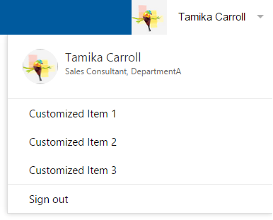

fms.TocTitle: JavaScript UI controls
Title: Office 365 JavaScript UI controls
Description: Find information about user-interface controls that you can use with Office 365.
ms.ContentId: 088d5611-85ac-4e10-b36a-3a29a1827e68
ms.topic: article (how-tos)
ms.date: December 2, 2015

[!INCLUDE [Add the O365API repo styles](../includes/controls/addo365apistyles.xml)]

# Office 365 JavaScript controls

_**Applies to:** Office 365_

You can use the Office 365 JavaScript UI controls to add an Office 365-style navigation bar to your app and also let users access data about people in Azure Active Directory (AAD). These JavaScript UI controls do not require server-side code, and can be integrated into a single-page application (SPA) with just a few lines of code. 

If you want to customize the UI or data provider for these controls , you could find them on [OfficeDev – GitHub](https://github.com/OfficeDev):
*	[Office 365 People Controls](https://github.com/OfficeDev/Office-365-People-Controls)
*	[Office 365 AppChrome Control](https://github.com/OfficeDev/Office-365-AppChrome-Control)

These UI controls, which can work independently or together, include: 
* AppChrome - With the AppChrome control, your app can show  an Office 365-style navigation bar as well as customized links. This enables users to sign in and out of their Office 365 account and navigate to sites and pages that you'd like to feature.
  
  _AppChrome control before a user signs in_
  
 

  _AppChrome control after a user signs in_
 
 

  _AppChrome control with customized links_
  
 
 
 
 * People Picker - With the People Picker control, a user can search the people in their organization directory by typing in a keyword, then, people in the directory who match the search results are shown.  

  _People Picker_

  

* Persona Card - With the Inline Persona Card and Detailed Persona Card, a user can see information about a person in their organization. The Persona Card displays data from a source such as the People Picker control. When a user clicks the Inline Persona Card, they can see more information about the selected user on the Detailed Persona Card. 

  _Inline Persona Card_
  
   
  
  _Detailed Persona Card_
  
   

  _After Inline Persona Card gets clicked_
  
  

## Add Office 365 controls code
* Add AppChrome control code
```html
<script src="https://controls.office.com/people/1.0/Office.Controls.People.min.js"></script>
<link href="https://controls.office.com/people/1.0/Office.Controls.People.min.css" rel="stylesheet">
<script src="https://controls.office.com/appChrome/1.0/Office.Controls.AppChrome.min.js"></script>
<link href="https://controls.office.com/appChrome/1.0/Office.Controls.AppChrome.min.css" rel="stylesheet">
```

* Add People control code
```html
<script src="https://controls.office.com/people/1.0/Office.Controls.People.min.js"></script>
<link href="https://controls.office.com/people/1.0/Office.Controls.People.min.css" rel="stylesheet">
```

#AppChrome 
## Before you start

If you haven't already created a single-page app to host the Office 365 JavaScript controls, take a look at [Create an app with Office 365 APIs](https://msdn.microsoft.com/office/office365/howto/getting-started-Office-365-APIs?o365apifilter=javascript) for detailed instructions on getting set up.

**Note** Please configure your app to allow the OAuth 2.0 implicit grant flow.

## Create AppChrome in SPA

### Create the AppChrome control

**Syntax**
```javascript
new Office.Controls.AppChrome(appTitle, container, loginProvider, options) 
```
**Parameters**

|Parameter | Type | Description 
|:-----|:-----|:-----|
|appTitle | String | The app name displayed on the AppChrome control's navigation bar. The default value is "3rd Party App". |
|container | Object | The HTML element that contains the AppChrome control. |
|loginProvider | Object | The object that handles sign-in logic, which is required by the AppChrome control. |
|options | Object | Optional. The object that contains various options supported by the AppChrome control.|

  **Return Value**
  
    Type: Object
    An AppChrome Object

### Permissions

Permissions required to configure in AAD

| Control Name |  Application Name | Application Permissions | Delegated Permissions |
|:-----|:-----|:-----|:-----|
|AppChrome|Azure Active Directory||Sign in and read user profile|	


### Reference

* #### options
```javascript
{
    "appHomeUrl": "", // type: String. description: The link for appTitle. The default value is null.
    "onSignIn": function() {}, // description: The Listener function will be called when user clicks the "Sign in" button.
    "onSignOut": function() {}, // description: The Listener function will be called when user clicks the "Sign out" button.
    "customizedItems": // type: Object. description: The custom items displayed in dropdown list below inline persona. The dropdown list will be available only when current user is signed in.
    { 
         <displayName1>: <linkUrl1>,         
         <displayName2>: <linkUrl2>,
         ...
         <displayNameN>: <linkUrlN>
    } 
}
```
* #### loginProvider object
 This object must expose the following functions, which will be invoked by the AppChrome control: 
```javascript
{
    function login() {} // required. The function to call to sign in. When this function is called, the client app redirects the user to the Azure AD authorization endpoint. After authenticating, the user should be redirected back to the client application. 
    function logout() {} // required. The function to call to sign out. When this function is called, the user signs out. The client app redirects the user back to the specified endpoint. 
    function getUserInfoAsync(callback) {} // required.The function to get user data which will be displayed in the inline persona.   
       //  callback(error, userData)
       //      error: type: String. description: An error message if the call to get userData fails.
       //      userData: type: Object. description: Contains the below key-value pairs of user's information, displayed in inline Persona after login.
       //      { 
       //       "account": "", // type: String. description: Registered account name, displayed in inline persona. 
       //       "userName": "", // type: String. description: The user's name, displayed both in navigation bar and inline persona. 
       //       "imgSrc": "" // type: String. description: It's displayed both in navigation bar and inline persona. If it is not provided, a default image will be displayed.  
       //      } 
    function hasLogin() {} // optional. The function is used to check sign-in status. If this function isn't provided, the AppChrome control uses getUserInfoAsync(callback) to determine whether to show the user's sign-in status.
}
```
Note: When the Implicit Grant Type is used, you can use the ImplicitGrant loginProvider. Please refer to "How to create ImplicitGrant loginProvider" and Office.Controls.Login.js ("https://controls.office.com/appChrome/1.0/Office.Controls.Login.js") for detailed information. When Authorization Code Grant Flow is used, the loginProvider object should be provided by third-party developers. 
* ### How to create ImplicitGrant loginProvider
* Add ImplicitGrant loginProvider code
```html
<script src="https://secure.aadcdn.microsoftonline-p.com/lib/1.0.0/js/adal.min.js"></script>
<script src="https://controls.office.com/appChrome/1.0/Office.Controls.Login.min.js"></script>
 ```
* Create ImplicitGrant loginProvider
```javascript
var config = {
        var clientId = "********-****-****-****-************",  //Please replace with your clientID
        redirectUri: window.location.href,
        postLogoutRedirectUri: window.location,
        cacheLocation: 'localStorage' // enable this for Internet Explorer, as sessionStorage does not work for localhost.
};
var loginProvider = new Office.Controls.ImplicitGrantLogin(config);
```

#People Picker

## Before you start

If you haven't already created a single-page app to host the Office 365 JavaScript UI controls, take a look at [Create an app with Office 365 APIs](https://msdn.microsoft.com/office/office365/howto/getting-started-Office-365-APIs?o365apifilter=javascript) for detailed instructions on getting set up.

**Note** Please configure your app to allow the OAuth 2.0 implicit grant flow.

## Create People Picker in SPA

### Create the People Picker control

**Syntax**
```javascript
Office.Controls.PeoplePicker.create(container, authContext, options);
```
**Parameters**

|Parameter | Type | Description 
|:-----|:-----|:-----|
|container | Object | The HTML element that contains the People Picker control. |
|authContext | Object | The object created by ADAL to access Office 365 data. |
|options | Object | Optional. The object that contains various options supported by People Picker.|

  **Return Value**
  
    Type: Object

    A People Picker Object

### Method

**Syntax**
```javascript
function getAddedPeople()
```
**Return Value**
    
    Type: Object
    
    An array of person objects. These are the items picked from search results. 
    
### Permissions

Permissions required to configure in AAD

| Control Name |  Application Name | Application Permissions | Delegated Permissions | Comments |
|:-----|:-----|:-----|:-----|:-----|
|People control|Azure Active Directory||Sign in and read user profile|All the People controls require this permission|
|People Picker|Azure Active Directory||Read all users' basic profiles||	
|Persona Card|Azure Active Directory||Read all users' basic profiles||	
|Persona Card|Azure Active Directory||Read all users' full profiles|AAD requires higher permission if app needs to get users' phone numbers. "admin_consent" need to be set for parameter "prompt" in [authorization code grant flow](https://msdn.microsoft.com/en-us/library/azure/dn645542.aspx).|

  |

### Reference

* #### options
```javascript
{
    "allowMultipleSelections": false, // type: bool. default: false. description: determines whether a user can pick multiple people
    "showImage": true, // type: bool. default: true. description: determines whether to show a person's avatar image 
    "inputHint": "Type name...", // type: String. default: "Type name...". description: determines the hint text to show in the search input field
    "onChange": function(peoplePickerObject) {}// type: function. description: the event-handler function called when a person is picked or deleted
}
```
	
#Persona Card

## Create Persona Card in SPA

### Create an Inline Persona Card

**Syntax**
```javascript
Office.Controls.Persona.PersonaHelper.createInlinePersona(container, personObject, event);
```

**Parameters**


| Parameter     | Type   | Description|
|:-----|:-----|:-----|
| container     | Object | The HTML element that contains Inline Persona Card.|
| personObject| Object | The person data object.|
| event         | String | Optional. The event to show or hide the Detailed Persona Card. The only supported value is **click**.|

### Create a Detailed Personal Card

**Syntax**
```javascript
Office.Controls.Persona.PersonaHelper.createPersonaCard(container, personObject);
```

**Parameters**

| Parameter     | Type   | Description|
|:-----|:-----|:-----|
| container     | Object | The HTML element that contains Detailed Persona Card.|
| personObject| Object | The person data object.|


### Reference

* #### person object
```javascript
    {
       "displayName": "", // type: String. description: display name 
       "department": "", // type: String. description: department
       "description": "", // type: String. description: description of the person
       "jobTitle": "", // type: String. description: job title
       "mail": "", // type: String. description: e-mail address
       "workPhone": "", // type: String. description: work phone number
       "mobile": "", // type: String. description: mobile phone number
       "office": "", // type: String. description: office address
       "sipAddress": "", // type: String. description: sip address
       "alias": "", // type: String. description: alias
       "personId": "", // type: String. description: GUID of the person
       "imgSrc": ""// type:String. description: URL to avatar image
   }
```

# Sample application

In this step, you'll set up a single-page application with all the controls. It uses AppChrome control to handle the login process. And after a user signs in, he can use People Picker and Persona Card to get data.

**Note** You should replace the '********-****-****-****-************' with a valid client ID for your application. See [Create an app with Office 365 APIs](https://msdn.microsoft.com/office/office365/howto/getting-started-Office-365-APIs?o365apifilter=javascript) for detailed instructions on getting set up. Please configure your app to allow the OAuth 2.0 implicit grant flow.

* Create an empty HTML file, then copy the following code to it and save the file. Open the HTML file in a supported browser. Then, sign in using your Office 365 credentials in AppChrome and use the People Picker to pick a person. That person's info is displayed in JSON format as well as within a Persona Card. 
```html
<!DOCTYPE html>
<html>
  <head>
      <title>Sample App with People controls</title>
      <script src="https://secure.aadcdn.microsoftonline-p.com/lib/1.0.0/js/adal.min.js"></script>
      <script src="https://controls.office.com/people/1.0/Office.Controls.People.min.js"></script>
      <link href="https://controls.office.com/people/1.0/Office.Controls.People.min.css" rel="stylesheet">
      <script src="https://controls.office.com/appChrome/1.0/Office.Controls.Login.min.js"></script>
      <script src="https://controls.office.com/appChrome/1.0/Office.Controls.AppChrome.min.js"></script>
      <link href="https://controls.office.com/appChrome/1.0/Office.Controls.AppChrome.min.css" rel="stylesheet">
      <script>
          window.onload = function() {
             var implicitGrantLogin = createLoginProvider();
             createAppChrome(implicitGrantLogin);
             var authContext = implicitGrantLogin.getAuthContext();
             showPeoplePicker(authContext);
          };

          function createLoginProvider() {
             var config = {
                clientId: "********-****-****-****-************", //Please replace with your clientID
                redirectUri: window.location.href,
                postLogoutRedirectUri: window.location,
                cacheLocation: 'localStorage' // enable this for IE, as sessionStorage does not work for localhost.
              };
              
            var loginProvider = new Office.Controls.ImplicitGrantLogin(config);
            return loginProvider;
          }

          function createAppChrome(loginProvider) {
            var ItemtoAdd = {
                "Customized Item 1": "http://www.contoso.com/item1", // put your customized item 1 page
                "Customized Item 2": "http://www.contoso.com/item2", // put your customized item 2 page
                "Customized Item 3": "http://www.contoso.com/item3" // put your customized item 3 page
              };
            options = new Object();
            options.appHomeUrl = "http://www.contoso.com/"; // put your home page url 
            options.customizedItems = ItemtoAdd;
            var appChrome = new Office.Controls.AppChrome("Contoso App", document.getElementById('container'), loginProvider, options);
          }

          function showPeoplePicker(userAuth) {
                  var options = {
                      "allowMultipleSelections": true,
                      "showImage": true,
                      "onChange": function(control) {
                          clear();
                          var pickedUsers = control.getAddedPeople();
                          document.getElementById("resultJSON").textContent = JSON.stringify(pickedUsers, null, 4);
                          if(pickedUsers != null) {
                            showInlinePersona(pickedUsers[pickedUsers.length - 1]);
                            showDetailedPersona(pickedUsers[pickedUsers.length - 1]);
                          }
                      }
                  };
                  Office.Controls.PeoplePicker.create(document.getElementById("payload"), userAuth, options);
          }
          
          function showInlinePersona(person) {
               var personaContainer = document.getElementById("inlinePersona");
               Office.Controls.Persona.PersonaHelper.createInlinePersona(personaContainer, person, "click");   
          }
          
          function showDetailedPersona(person) {
                var personaContainer = document.getElementById("detailedPersona");
                Office.Controls.Persona.PersonaHelper.createPersonaCard(personaContainer, person);
          }
          
          function clear(){
              document.getElementById("inlinePersona").innerHTML = "";
              document.getElementById("detailedPersona").innerHTML = "";
              document.getElementById("resultJSON").innerHTML = "";
          }
      </script>
  </head>
  <body>
      <div id="container"></div>
      <span id = "userProfile"></span>
      <div id = "payload"></div>
      <H5>InlinePersona(Recent Picked User):</h5>
      <div id = "inlinePersona"></div>
      <h5>Picked Users:</h5>
      <div id = "resultJSON"></div>
      <h5>DetailedPersona(Recent Picked User):</h5>
      <div id = "detailedPersona"></div>
  </body>
</html>
```

# Supported browsers
The Office 365 JavaScript UI controls are supported by the following web browsers:
* Internet Explorer 10+
* Chrome 43+
* Firefox 39+

# Feedback
You can send us feedback on UserVoice using the [Office Web Widgets](http://officespdev.uservoice.com/forums/224641-general/category/79970-office-web-widgets) category.